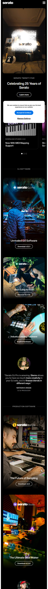
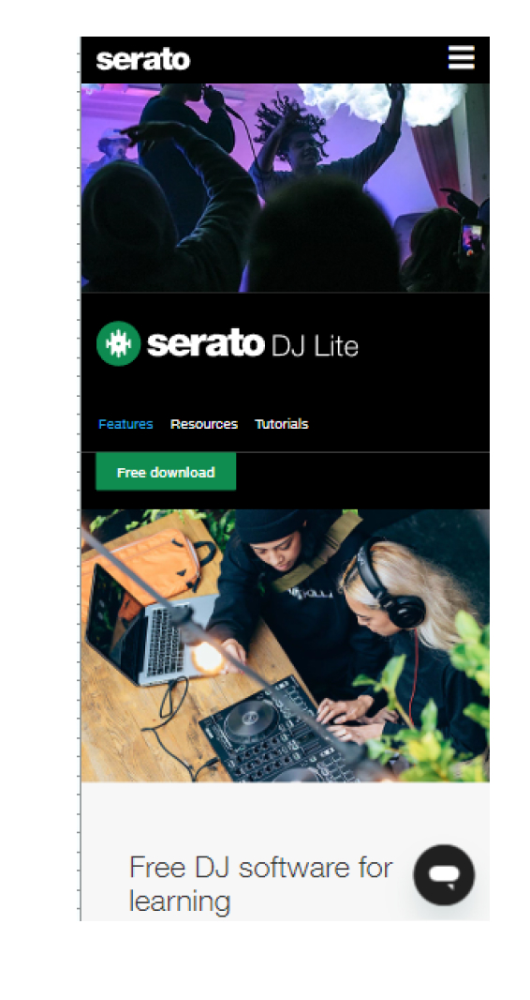
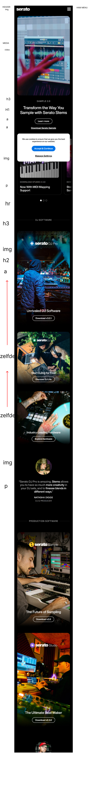
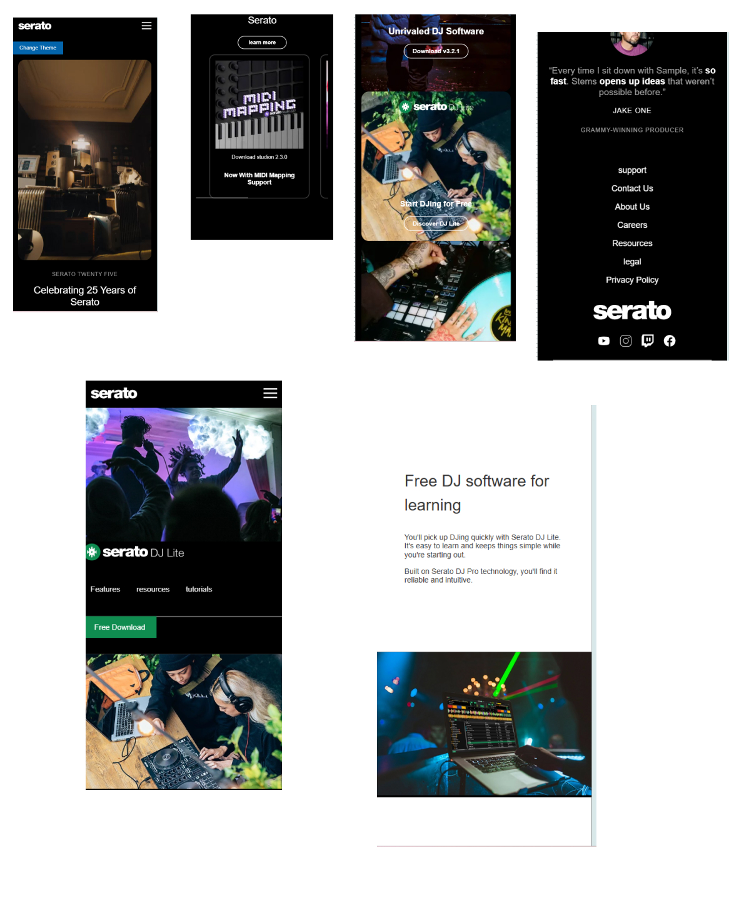
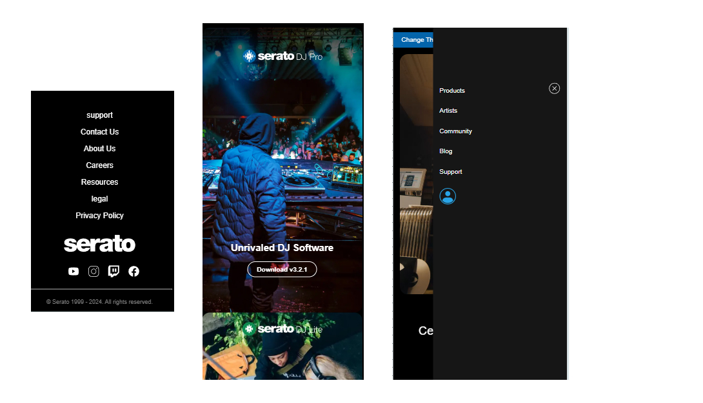
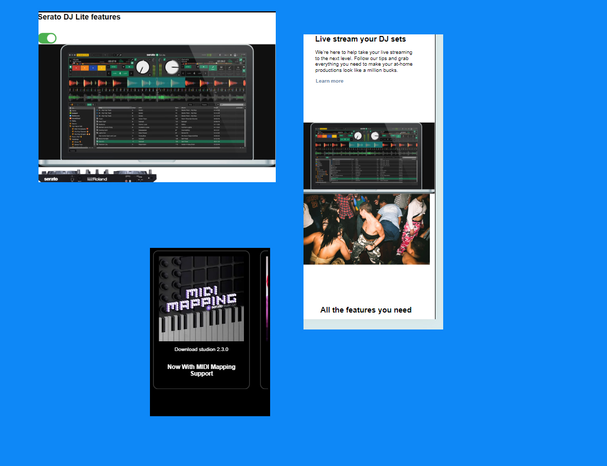

# Procesverslag
Markdown is een simpele manier om HTML te schrijven.  
Markdown cheat cheet: [Hulp bij het schrijven van Markdown](https://github.com/adam-p/markdown-here/wiki/Markdown-Cheatsheet).

Nb. De standaardstructuur en de spartaanse opmaak van de README.md zijn helemaal prima. Het gaat om de inhoud van je procesverslag. Besteedt de tijd voor pracht en praal aan je website.

Nb. Door *open* toe te voegen aan een *details* element kun je deze standaard open zetten. Fijn om dat steeds voor de relevante stuk(ken) te doen.

## Nolie

  
uitwerken voor kick-off werkgroep

  ### Auteur:
  Nolivin 

  #### Je startniveau:
  blauw

  #### Je focus:
 surface plane
 

## serato

  
uitwerken voor kick-off werkgroep

  ### Je opdracht:
  pagina 1  https://serato.com/
  pagina 2 : https://serato.com/dj/lite

  #### Screenshot(s) van de eerste pagina (small screen): 
  hier de naam van de pagina  
  

  #### Screenshot(s) van de tweede pagina (small screen):
  hier de naam van de pagina  
  
 

## Toegankelijkheidstest 1/2 (week 1)

  
uitwerken na test in 2e werkgroep

  ### Bevindingen
  Lijst met je bevindingen die in de test naar voren kwamen:

  vdieo's dat automatisch speelde

  was niet zo toegangelijke

  geen structuur

## Breakdownschets (week 1)

  
uitwerken na afloop 3e werkgroep

  ### de hele pagina: 
  

<!-- had ik niet op het moment  -->
  ### dynamisch deel (bijv menu): 
  
<!-- ik had geen filters  -->
  ### wellicht nog een dynamisch deel (bijv filter): 
  

## Voortgang 1 (week 2)

  
uitwerken voor 1e voortgang

  ### Stand van zaken
  Ik had alleen hier een code van de websites wat hier
  slecht ging was alleen dat ik div gebrukte in plaats van een article.

  ### Agenda voor meeting
  samen met je groepje opstellen

  | student 1      | student 2          | student 3    | student 4        |
  | ---            | ---                | ---          | ---              |
  | dit bespreken  | en dit             | en ik dit    | en dan ik dat    |
  | en dat ook nog | dit als er tijd is | nog een punt | dit wil ik zeker |
  | ...            | ...                | ...          | ...              |

  ### Verslag van meeting
  hier na afloop snel de uitkomsten van de meeting vastleggen

  - mag ik classes gebruiken 
  - beter articles gebruiken 
  - 
  - ...

## Voortgang 2 (week 3)

  
uitwerken voor 2e voortgang

  ### Stand van zaken
  Had me html van me eerste pagina afgemaakt met een kleine basis css. moest persoonlijk de tempo wat hoger leggen.

  ### Agenda voor meeting
  samen met je groepje opstellen

  | student 1      | student 2          | student 3    | student 4        |
  | ---            | ---                | ---          | ---              |
  | dit bespreken  | en dit             | en ik dit    | en dan ik dat    |
  | en dat ook nog | dit als er tijd is | nog een punt | dit wil ik zeker |
  | ...            | ...                | ...          | ...              |

  ### Verslag van meeting
  hier na afloop snel de uitkomsten van de meeting vastleggen

  - grid gebruiken of flexbox 
  - nette code
  -
- ...

## Toegankelijkheidstest 2/2 (week 4)

  
uitwerken na test in 9e werkgroep

  ### Bevindingen
  Lijst met je bevindingen die in de test naar voren kwamen (geef ook aan wat er verbeterd is):

  dat ik veel dingen op mijn eigen site best heel toegangelijk waren behalve bij mijn video en betreft met link. ik had ook helemaal geen alt teksten op me hele html pagina's.

## Voortgang 3 (week 4)

  
uitwerken voor 3e voortgang

  ### Stand van zaken
  hier dit ging goed & dit was lastig (neem ook screenshots op van delen van je website en code)

  ### Agenda voor meeting
  samen met je groepje opstellen

  | student 1      | student 2          | student 3    | student 4        |
  | ---            | ---                | ---          | ---              |
  | dit bespreken  | en dit             | en ik dit    | en dan ik dat    |
  | en dat ook nog | dit als er tijd is | nog een punt | dit wil ik zeker |
  | ...            | ...                | ...          | ...              |

  ### Verslag van meeting
  hier na afloop snel de uitkomsten van de meeting vastleggen

  - Dat ik meer de inspecter moet gebruiken om fouten sneller terug te vinden 
  - Ben beter geworden om bepaald html punten aan te spreken om css
  - 
  - ...

## Eindgesprek (week 5)

  
uitwerken voor eindgesprek

  ### Je uitkomst - karakteristiek screenshots:
  

  ### Dit ging goed/Heb ik geleerd: 
  wat goed ging was de article vakken van de home pagina, css van de meeste dingen.Ik heb met vergelijken met vorige echt verbetering gebracht in me code waarddor ik vindt dat ik best veel dingen goed heb gedaan.

  

  ### Dit was lastig/Is niet gelukt:
  de switch toggle was niet gelukt wat ik na wou maken van de origanel site en de carrousel vanwege gebrek van kennis  en tijd. Ik had ook een beetje moeite met de surface plane bedenekn.de tweede pagina snapte ik niet hoe ik het moest opgeven want er was veel content all maar nergens specifiek een h1 waardooor me css html niet samantisch is.

  

## Bronnenlijst

  
continu bijhouden terwijl je werkt

  Nb. Wees specifiek ('css-tricks' als bron is bijv. niet specifiek genoeg). 
  Nb. ChatGpT en andere AI horen er ook bij.
  Nb. Vermeld de bronnen ook in je code.

  1. Me change button knop was meer voor het hoe ik me code op html/css/java kleine beetje moest zetten met me custom properties  pen: https://chatgpt.com/share/6720b851-876c-8001-aa03-3756fe119f89
  
  2. Mijn hamburger menu dat ik me menu moest opmaken met behulp van Braham en chatgpt alleen voor de in brengen dat het hambuger op me scherm kwam en er niet naast.https://chatgpt.com/share/6720ba5d-7684-8001-9b6d-9011c6f7255f
  
  3. carrousel met een beetje uitlegt en hulp van jason/jesse 

  4. scroll/load animaties met chat gpt met eigen kleine aanpassingen : 
  https://chatgpt.com/share/67289edd-5284-8001-85c5-63df38198834

  5. toggle switch en de functie gemaakt met behulp van julian en thijs

  aangepaste functie door chat : https://chatgpt.com/share/6728a5a6-2b44-8001-a1ce-e2de08e2fc31

eind stand met hulp van julian het verder aangepast

